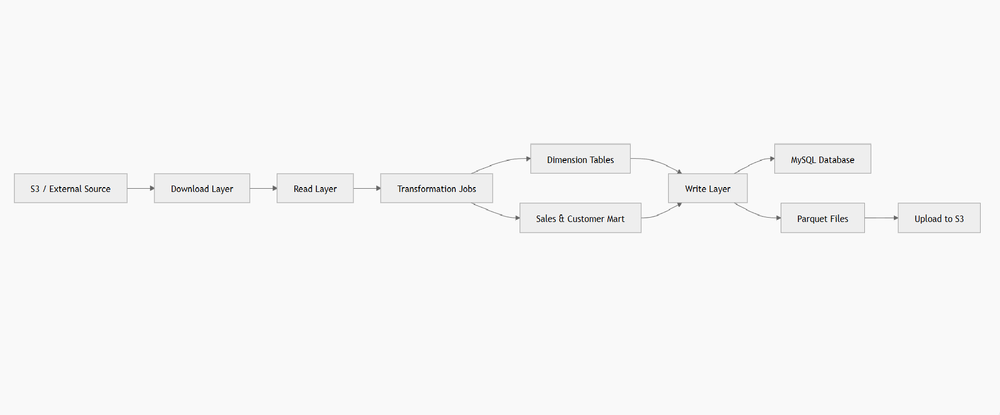

# **Python PySpark ETL Data Pipeline – Retail Sales Data**

---

* **Built an end-to-end backend ETL Data Pipeline using Python and PySpark**, retrieving raw CSV files from **AWS S3**, validating schemas, enriching data via **MySQL dimension tables**, and creating analytics-ready **Customer and Sales Team data marts**.
* **Implemented modular, layered architecture with Python packages** to separate file handling, database access, **Spark transformations**, and shared utilities, improving maintainability, debugging, and enabling future enhancements.
* **Optimized Spark ETL with partitioned Parquet storage** by Converting ~500,000 CSV retail transactions to Parquet, reducing storage by **~59%** (1.9 GB → 780 MB), leveraged Spark **window functions** for rankings and business calculations (e.g., top salesperson incentives), improving query performance by **~43%** (14 s → 8 s) and reducing monthly analytics query time by **~31%** (11.5 s → 8 s).
* **Deployed production-ready workflow with Python/PySpark and Docker**, including centralized logging, environment-specific configs (dev/QA/prod), automated S3 uploads, MySQL staging updates (active/inactive), and synthetic test dataset generation with **Faker**, completing the full ETL in **~1–2 minutes** on local development (8–16 GB RAM).


  ---


##  Tech Stack

* **Python 3.10** – Core programming language
* **PySpark** – Distributed data processing
* **MySQL** – Dimension tables & data marts
* **AWS S3** – Raw & processed data storage
* **Parquet** – Partitioned, analytics-ready storage
* **Faker** – Synthetic data generation
* **Docker** – Optional local Spark setup
* **Logging & Utilities** – Encryption,decryption, AWS clients, Spark session management, file handling

---

<h2 align="center">Data Architecture</h2>
<p align="center">
  
</p>

<h2 align="center">Data Model</h2>
<p align="center">
  
</p> 

---

## Project Structure
A modular **AWS + Spark + MySQL + S3 based data processing pipeline** supporting multiple environments (**dev, qa, prod**) with transformation jobs for staging, dimension, and mart tables.

```
my_project/
│
├── docs/                                  # Documentation and README
│   └── readme.md
│
├── resources/
│   ├── __init__.py
│   │
│   ├── dev/                               # AWS, MySQL, S3 configs (dev)
│   │   ├── config.py
│   │   └── requirement.txt
│   │
│   ├── qa/                                # AWS, MySQL, S3 configs (qa)
│   │   ├── config.py
│   │   └── requirement.txt
│   │
│   ├── prod/                              # AWS, MySQL, S3 configs (prod)
│   │   ├── config.py
│   │   └── requirement.txt
│   │
│   └── sql_scripts/                       # Dimension & staging table creation
│       └── table_scripts.sql
│
├── src/
│   ├── main/
│   │   ├── __init__.py
│   │
│   │   ├── delete/                        # Delete operations
│   │   │   ├── aws_delete.py
│   │   │   ├── database_delete.py
│   │   │   └── local_file_delete.py
│   │   │
│   │   ├── download/                      # Download from S3
│   │   │   └── aws_file_download.py
│   │   │
│   │   ├── move/                          # File movement logic
│   │   │   └── move_files.py
│   │   │
│   │   ├── read/                          # Read from AWS / Database
│   │   │   ├── aws_read.py
│   │   │   └── database_read.py
│   │   │
│   │   ├── transformations/               # Data transformation layer
│   │   │   └── jobs/
│   │   │       ├── customer_mart_sql_transform_write.py
│   │   │       ├── sales_mart_sql_transform_write.py
│   │   │       ├── dimension_tables_join.py
│   │   │       └── main.py
│   │   │
│   │   ├── upload/                        # Upload to S3
│   │   │   └── upload_to_s3.py
│   │   │
│   │   ├── utility/                       # Common utilities
│   │   │   ├── encrypt_decrypt.py
│   │   │   ├── logging_config.py
│   │   │   ├── s3_client_object.py
│   │   │   ├── spark_session.py
│   │   │   └── my_sql_session.py
│   │   │
│   │   └── write/                         # Write to DB / Parquet
│   │       ├── database_write.py
│   │       └── parquet_write.py
│   │
│   └── test/
│       ├── scratch_pad.py
│       └── generate_csv_data.py
```


## Data Flow and Features

1. **Data Generation (for testing/demo)**

   * Generates synthetic datasets for:

     * Customers
     * Stores
     * Products
     * Salespersons
     * Transactions
   * Uses the **Faker** library.

2. **AWS S3 Integration**

   * Securely downloads raw CSV files.
   * Uploads processed **Parquet files** for analytics storage.

3. **Backend Data Processing**

   * Prepares structured outputs ready for analytics.

4. **Schema Validation**

   * Checks for **mandatory columns** in incoming files.
   * Separates **invalid files** for auditing and review.

5. **Data Enrichment**

   * Joins validated data with **MySQL dimension tables**:

     * Customers
     * Stores
     * Products
     * Sales Team

6. **Data Marts Creation**

   * **Customer Data Mart**: Aggregates total purchases per customer.
   * **Sales Team Data Mart**: Calculates monthly sales and rankings using **Spark window functions**.

7. **Partitioning & Spark Optimization**

   * Writes **partitioned Parquet files** by `sales_month` and `store_id` for faster analytics.
   * Uses **Spark window functions** for ranking and aggregation.

8. **Business Calculations**

   * Calculates incentives for **top-ranked salespersons**.
   * Example: Top salesperson receives **1% of total sales**.

9. **Automated Cleanup & Staging Update**

   * Moves processed files to **S3**.
   * Deletes local temporary files to free space.
   * Updates **MySQL staging table** status.

10. **Production-Ready Execution**

    * **Docker-based Spark setup** for local or distributed execution.
    * Centralized **logging** for auditing and debugging.
    * Environment-specific configuration for **dev, QA, and prod**.

11. **Layered Architecture**

    * Modular Python packages manage:

      * File operations
      * Database access
      * Transformations
      * Utilities for maintainability and scalability

<p align="center">
  
</p>

**Generate → Validate → Enrich → Transform → Aggregate → Store → Cleanup**
---

## Performance Observations (Local Execution)

* Tested with **~500,000** synthetic retail transactions.
* Converting CSV to Parquet reduced storage by **~59%** (from ~1.9 GB → ~780 MB).
* Reading Parquet improved query performance by **~43%** (total sales/month: 14s → 8s).
* Partitioning by **sales_month** and **store_id** reduced query time by **~31%** for monthly analytics (11.5s → 8s).
* End-to-end ETL execution completed in **~1–2 minutes** on local dev environment (8–16 GB RAM).

---
## Final Deliverables

* Automated ETL pipeline: S3 → PySpark → MySQL → Parquet → S3
* Customer & Sales Team Data Marts with KPIs
* Partitioned, optimized Parquet storage
* Secure AWS credential handling
* Modular, layered architecture for maintainability
* Production-ready workflow: Docker, logging, environment separation
* Synthetic dataset for testing/demo
  
---

 **How to Run the Project**

1. **Clone the repository**

   ```bash
   git clone <your_repo_url>
   cd Python-Pyspark-ETL
   ```

2. **Set up environment**

   * Install Python dependencies:

   ```bash
   pip install -r requirements.txt
   ```

   * Configure AWS, MySQL, and environment settings in `resources/dev/config.py` (or QA/prod)

3. **Run locally with Docker Spark (optional)**

   * Start Spark session using Docker if needed for distributed execution

4. **Execute ETL pipeline**

   ```bash
   python src/main/transformations/jobs/main.py
   ```

5. **Check processed files**

   * Verify S3 for partitioned Parquet files and MySQL for updated data marts

---

**Author:** Utkarsh Reddy Nathala

**LinkedIn:** https://www.linkedin.com/in/utkarsh-reddy-nathala-b5b56728a/

